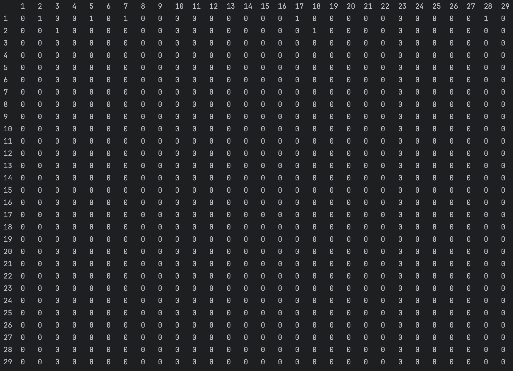
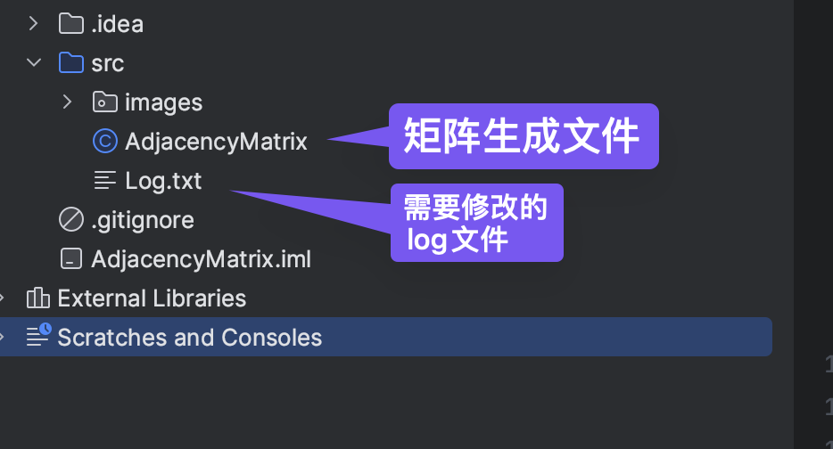
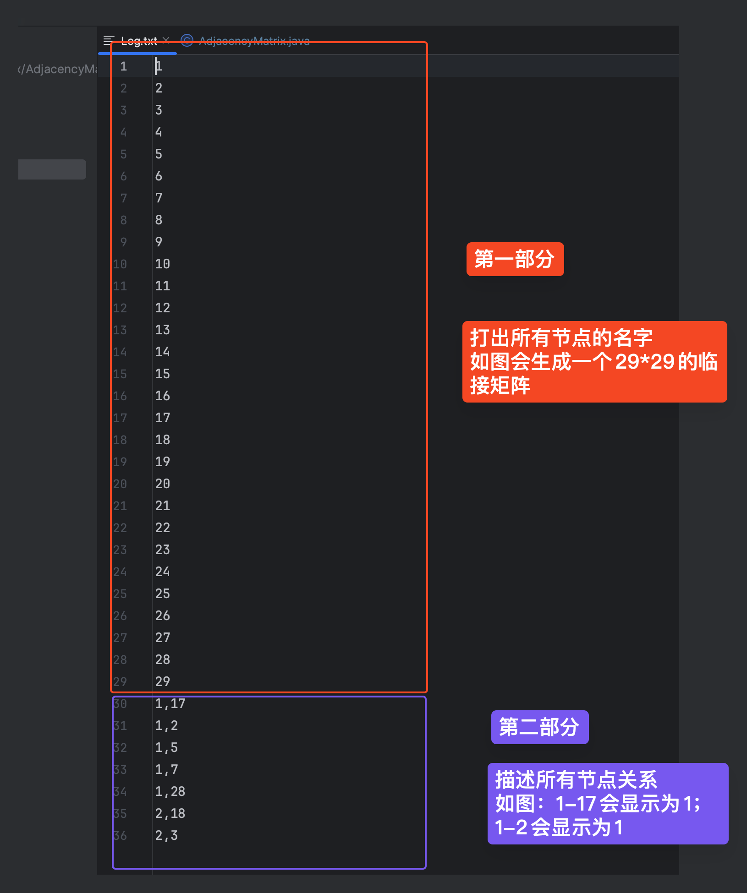

# AdjacencyMatrix
SAaT coursework AdjacencyMatrix generator
### ⚠️注意：该项目只能生成临接矩阵，不能替代寻找hyperlink图的过程
## 输出结果

# 教程
## 第一步
将项目git到电脑上
## 第二步
验证文件，找到需要修改的log文件

## 第三步
按照自己的hyperlink图编辑log文件

## 第四步
运行AdjacencyMatrix.java文件
## 第五步
上传作业，睡觉
